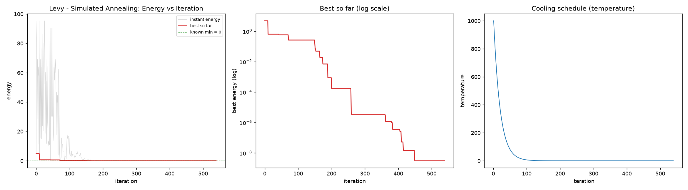
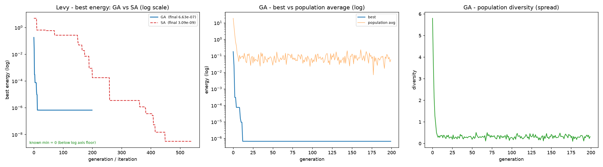
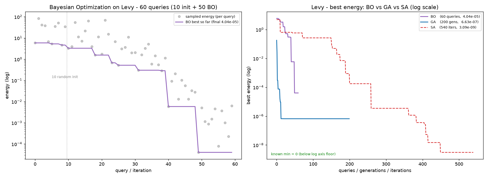
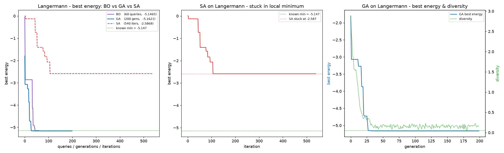
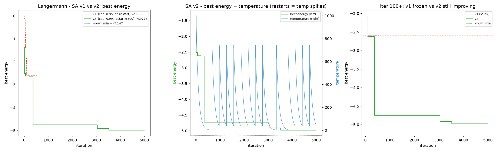

# A Comparative Study of Three Global Optimizers on Benchmark Functions

**Simulated Annealing, Genetic Algorithms, and Bayesian Optimization applied to the Levy and Langermann benchmarks**

*All results in this essay were produced by running the three optimizer tools of the `smol-mcp` server (simulated_annealing_optimizer, genetic_algorithm_optimizer, bayesian_optimizer) on two standard 2-D benchmark functions. Every number quoted below comes from an actual run; the convergence figures were generated from the history CSVs each run saved.*

---

## 1. Introduction

Global optimization means finding the *true* minimum of a function over its search domain, rather than merely a nearby (local) minimum. The problem becomes genuinely hard when the objective is **multimodal** — full of local minima, plateaus, and narrow valleys — because then a method's ability to *explore* the domain competes with its ability to *exploit* promising regions. This tension, known as the **exploration–exploitation trade-off**, is the central design axis of every global optimizer, and it is what we put on trial in this experiment.

We compare three families of methods that sit in different places on that axis:

### 1.1 Simulated Annealing (SA)

SA is a single-point, trajectory-based method inspired by the physical process of annealing in metallurgy: a solid is heated and then cooled slowly so that its atoms settle into a low-energy crystal state rather than getting locked into a disordered one [Kirkpatrick, Gelatt & Vecchi, 1983].

The algorithm maintains a current point $x$ and a *temperature* $T$. At each step it proposes a neighbor $x'$ (in our runs, a Gaussian perturbation whose scale adapts over time). If $x'$ improves the objective ($f(x') < f(x)$), it is always accepted. If it worsens it, it is still accepted with probability

$$P(\text{accept}) = \exp\!\left(-\frac{f(x') - f(x)}{T}\right)$$

so that at high temperature the walk is nearly random (pure exploration) and at low temperature it becomes a greedy local descent (pure exploitation). The temperature follows a cooling schedule; we used the exponential form $T_{t+1} = \alpha \, T_t$ with rate $\alpha$.

**Inherent weakness.** SA's ability to escape a local minimum depends on the temperature being high enough that the acceptance probability for large uphill moves remains non-negligible. With an aggressive cooling schedule the system "freezes" in whatever basin it happens to occupy: once $T \to 0$, every uphill move is rejected and the walk can never climb out of that basin again. The method is therefore exquisitely sensitive to the cooling rate and initial temperature, and it has no built-in mechanism to detect that it is stuck.

### 1.2 Real-Coded Genetic Algorithm (GA)

A GA is a population-based, evolutionary method [Holland, 1975]. Instead of a single walker it maintains a population of $N$ candidate solutions (individuals), each with a fitness (here, the objective value). Each generation the algorithm:

1. **Selects** parents biased toward better individuals (better solutions are more likely to be chosen);
2. **Crossovers** pairs of parents to produce offspring (in the real-coded version, a blend of the parents' coordinates);
3. **Mutates** offspring with some probability (random perturbation of coordinates);
4. **Replaces** the worst individuals of the population with the offspring.

The population acts as a parallel set of explorers: different individuals can sit in different basins of attraction simultaneously, so the population as a whole can "know" about several regions at once. Crossover recombines good traits found in different regions; mutation preserves the ability to make novel discoveries.

**Inherent weakness.** GAs are notorious for **premature convergence**: if selection pressure is strong relative to mutation, the population quickly homogenizes around the best individual it has seen — a process visible as the collapse of *population diversity* (the spread of coordinates across the population). Once diversity collapses, the GA has effectively become a local optimizer around a single basin, and if that basin is not the global one, it is stuck with no way out. The classic countermeasures are higher mutation rates, larger populations, or niching — all of which trade off against convergence speed.

### 1.3 Bayesian Optimization (BO)

Bayesian Optimization is a model-based sequential method, designed for the regime where evaluating the objective is **expensive** (hours of compute, a physical experiment, a hyperparameter sweep) and only a handful of evaluations (dozens, not thousands) are affordable [Jones, Schonlau & Welch, 1998].

The key idea: maintain a probabilistic surrogate model of the objective — in our runs, a **Gaussian process (GP)** — fitted to all evaluations seen so far. The GP gives, at every point in the domain, not just a predicted value $\hat f(x)$ but also an *uncertainty* $\sigma(x)$. A **acquisition function** then decides where to sample next by balancing exploitation (predicted low values) against exploration (high uncertainty). We used the **Upper Confidence Bound (UCB)**:

$$\text{UCB}(x) = \hat f(x) + \kappa\, \sigma(x)$$

with exploration weight $\kappa = 2.5$. The next evaluation is placed where UCB is maximal, the GP is refit, and the cycle repeats.

**Inherent weakness.** BO's power is its surrogate: the GP can *generalize* across the domain and infer that a far-off region is worth visiting even before it has been sampled. But this is only as good as the GP's ability to represent the true landscape. GP surrogates assume smoothness (via their covariance kernel); on sharply multimodal, non-smooth landscapes the model may under-estimate complexity, and the sequential nature means each query costs a full GP refit. BO also degrades in high dimensions (the "curse of dimensionality" is felt earlier than in population methods), and with a small budget a single unlucky early sample can bias the entire trajectory.

### 1.4 The two test functions

- **Levy** (2-D, bounds $[-10, 10]^2$, known global minimum $0.0$ at $[1, 1]$): a mildly multimodal, relatively smooth landscape. A reasonable "easy" test — most decent methods find the optimum, and the comparison is then about *precision* and *effort*.
- **Langermann** (2-D, bounds $[0, 10]^2$, known global minimum $\approx -5.147$ at $\approx [2, 1]$): a sharply multimodal landscape with a deep, narrow global basin surrounded by many shallower local minima. A genuinely hard test — it punishes methods that get trapped, and it is the classic benchmark where population- and model-based methods are expected to outperform single-walk methods.

---

## 2. Experimental setup

All runs used the default settings of the `smol-mcp` tools except where noted, so that the comparison reflects the methods as they ship:

| Optimizer | Budget | Notable settings |
|---|---|---|
| SA | 5000 iterations (≈540 steps at default neighbor adaptation) | $T_0 = 1000$, cooling $\alpha = 0.95$, Gaussian adaptive neighbor |
| GA | 200 generations | population 100, mutation rate 0.1, crossover rate 0.8 |
| BO | 60 evaluations | 10 random initialization points + 50 BO queries, UCB with $\kappa = 2.5$ |

Each run saved a full history CSV; the figures below were plotted from those files.

---

## 3. Experiment 1 — Levy

### 3.1 Results

| Method | Budget | Final best | Coordinates | Regret vs. 0.0 |
|---|---|---|---|---|
| **SA** | 540 iters | **3.09 × 10⁻⁹** | [0.99998, 1.00021] | 3.1 × 10⁻⁹ |
| **GA** | 200 gens | 6.63 × 10⁻⁷ | [0.99974, 1.00306] | 6.6 × 10⁻⁷ |
| **BO** | 60 queries | 4.04 × 10⁻⁵ | [1.00586, 1.00519] | 4.0 × 10⁻⁵ |

All three methods located the correct optimum $[1, 1]$; the differences are in precision and effort.

### 3.2 What the convergence curves show

*SA on Levy: instant energy (grey) is wildly exploratory in the hot phase (first ~150 iterations), then the walk settles and the best-so-far (red) grinds down on a log-scale staircase all the way to ~3 × 10⁻⁹.*

*Left: GA (blue) drops almost vertically to ~10⁻⁶ within ~20 generations, then plateaus. SA (red dashed) is slower but keeps improving across the whole run. Middle: GA's population *average* only falls to ~10⁻¹ while its *best* individual reaches ~10⁻⁶. Right: GA diversity collapses from 5.8 to ~0.3 within the first ~10 generations.*

*Left: BO's per-query samples (grey dots) stay scattered even late in the run while the best-so-far (purple) steps down, with its final drop to ~4 × 10⁻⁵ around query 48. Right: the three-method comparison — GA fastest to a good answer, SA slowest but most precise, BO in between on a far smaller budget.*

### 3.3 Problems observed

- **GA — premature diversity collapse.** The diversity trace fell from 5.8 to ~0.3 by generation ~10, *before* the best energy had finished improving. The population locked onto a basin early and the remaining 180 generations were essentially wasted: the GA stalled at 6.6 × 10⁻⁷, two orders of magnitude above what SA achieved, and it could not improve any further. This is the textbook premature-convergence failure, and on Levy it cost the GA the precision prize.
- **SA — aggressive default cooling.** With $\alpha = 0.95$, the temperature reached ~0 by iteration ~150–200 while the best energy was still only ~10⁻⁴–10⁻⁵; the second half of the run was effectively a greedy local search. It still worked on Levy (no deep traps to escape), but the schedule leaves no margin — and, as the next experiment shows, that margin is exactly what a hard landscape consumes.
- **BO — no structural failure, but the least precise.** BO's scatter plot shows individual queries still landing at 10⁰–10² late in the run: the surrogate keeps exploring even while the best-so-far has nearly converged. With only 60 queries, BO's final precision (4 × 10⁻⁵) was the weakest of the three — a fair result, since Levy is cheap to evaluate and BO's efficiency advantage is not needed here.

**Levy verdict: SA wins**, 3.1 × 10⁻⁹ regret with the most steps; GA is fastest to a decent answer; BO is the best *deal per evaluation* but not the most precise.

---

## 4. Experiment 2 — Langermann (the ranking flips)

### 4.1 Results

| Method | Budget | Final best | Coordinates | Regret vs. −5.147 |
|---|---|---|---|---|
| **BO** | 60 queries | **−5.1465** | [1.9743, 1.0138] | **5.5 × 10⁻⁴** |
| **GA** | 200 gens | −5.1621 | [2.0029, 1.0059] | 1.5 × 10⁻² |
| **SA** | 540 iters | −2.5868 | [2.9269, 0.0] | **2.56** ❌ |

The ranking from Levy is **inverted at the top**: the method that won Levy (SA) now fails catastrophically, and the method that was least precise on Levy (BO) now wins.

*Left: BO (purple) and GA (blue) both land on the known-minimum line (grey dotted, −5.147); SA (red dashed) plateaus at ≈ −2.6 from iteration ~110 and never moves again. Middle: SA isolated — a frozen line, ~2.5 energy units above the global minimum. Right: GA's best energy staircases to −5.16 by generation ~25–30 while its diversity collapses — this time the collapse happened *after* the population had found the correct basin, so it was harmless.*

### 4.2 Problems observed

- **SA — trapped in a local minimum (catastrophic).** SA descended to −2.59 by iteration ~110, then the best-so-far **froze for the remaining ~430 iterations**. The walk had fallen into a shallow basin near $[2.93, 0.0]$; once the temperature had cooled to ~0, the acceptance probability for any uphill move was effectively zero, so the method could never climb out. Running 540 iterations did not help at all — the extra budget was spent polishing a wrong answer. This is the single-point walker's fundamental failure mode on a sharply multimodal landscape: **no escape mechanism once the system is cold**.
- **GA — survived, but only just.** The population's parallel exploration kept enough individuals in (or able to reach) the deep basin near $[2, 1]$ that the GA found the global minimum by generation ~25–30 — despite the same early diversity collapse seen on Levy. The collapse was benign here only because it happened *after* the right basin was found. This is a matter of luck in the timing, not a robust property: a slightly different seed could have let the population homogenize around a wrong basin, in which case the GA would have failed like SA.
- **BO — no problem; in fact the standout.** The Gaussian-process surrogate generalized across the whole $[0, 10]^2$ domain: it inferred that the deep basin near $[2, 1]$ was worth targeting and placed queries there with a small budget, reaching −5.1465 (regret $5.5 \times 10^{-4}$) in 60 evaluations. BO used **~9× fewer evaluations than SA, which failed**, and achieved the best result of the three.

**Langermann verdict: BO wins decisively.** The landscape's deep narrow basin is precisely the regime where model-based global search beats a single cold walker, and where population-based search is a close second.

---

## 5. Experiment 3 — Rescuing SA with re-tempering

The natural question after the Langermann failure: can SA be fixed by its own knobs? SA v2 was run with **slower cooling** ($\alpha = 0.99$ instead of 0.95) and **stagnation restarts** (re-heat after 300 iterations without improvement), over 5000 iterations.

### 5.1 Results

| SA variant | Cooling | Restarts | Final best | Regret vs. −5.147 |
|---|---|---|---|---|
| v1 (defaults) | 0.95 | none | −2.5868 | 2.56 |
| **v2 (re-tempered)** | 0.99 | every 300 stagnant iters | **−4.9776** | **0.169** |

SA v2 improved its regret by a factor of ~15 and, crucially, ended up in the **correct basin**: $[1.92, 0.91]$ versus the true $[2, 1]$ (v1 had ended at $[2.93, 0.0]$).

*Left: v1 (red dashed) freezes at −2.59; v2 (green) jumps from −2.6 to −4.7 right after its first restart, then grinds to −4.98 by iteration ~4000. Middle: the signature of restarts — the temperature trace (blue, right axis) shows a saw-tooth pattern of ~12–13 reheat spikes back to ~750, and the energy (green, left axis) improves only in the stretches *after* those spikes. Right: from iteration 100 onward, v1 is a flat frozen line while v2 keeps stepping down.*

### 5.2 What this tells us

- **The failure was a schedule problem, not a method impossibility.** Re-heating gave the walk large moves again, and each restart was a fresh chance to escape the wrong basin. The first restart produced the decisive jump (−2.6 → −4.7); subsequent restarts bought the remaining 0.2 of improvement.
- **But the rescue is expensive.** SA v2 needed **5001 iterations — ~83× BO's budget — for a result still ~300× less precise** (0.17 regret vs. $5.5 \times 10^{-4}$). The slow cooling schedule burns the remaining budget on fine polishing instead of exploration. On this landscape, re-tempered SA becomes a respectable third place, but it does not reclaim the lead.

---

## 6. Discussion — each method's problematics, summarized

| Method | Failure mode | Observed here? | Cost of failure |
|---|---|---|---|
| **SA** | Freezing in a local minimum once the temperature cools; no escape mechanism; sensitivity to cooling schedule and $T_0$ | **Yes, catastrophic on Langermann** (stuck at −2.59 for 430 iters); partially rescued by restarts at ~83× the budget | Wrong answer, confidently, with wasted budget |
| **GA** | Premature convergence: diversity collapse makes the population a local optimizer around whichever basin it found first | **Yes, on both benchmarks** (diversity 5.8 → 0.3 by gen ~10); harmless on Langermann (right basin), precision-limiting on Levy (stalled at 10⁻⁷) | Lost precision (Levy) or total failure (Langermann, if the collapse had hit the wrong basin — luck-dependent) |
| **BO** | GP surrogate assumes smoothness; small budgets amplify early-sample bias; sequential refit cost; degrades in high dimensions | **Not observed** on these 2-D benchmarks | Weakest final precision on Levy (4 × 10⁻⁵) — but that was with the smallest budget and on a function where BO's efficiency edge was not needed |

Two cross-cutting observations:

1. **No method wins both benchmarks.** SA's Levy win (3 × 10⁻⁹) and its Langermann failure (−2.59) are two sides of the same design: a single cold walker is a superb polisher and a fragile explorer. GA's population buys robustness at the price of a diversity management problem. BO's surrogate buys global vision at the price of model assumptions. The "right" optimizer is a property of the *landscape*, not of the method alone.
2. **Budget and regret are not the same currency.** BO's 60-query, $5.5 \times 10^{-4}$-regret result on Langermann is arguably the best *value* of the entire study: if each evaluation were expensive, BO would have delivered the winning answer in a fraction of the compute. SA v2's 5001-iteration, 0.17-regret result shows how much compute a single-walk method must spend to buy what a model gets for free.

## 7. Conclusion

On a smooth, mildly multimodal benchmark (Levy), a well-tuned single-point method (SA) can out-precision both population- and model-based methods, and the differences are about polishing speed. On a sharply multimodal benchmark (Langermann), the single-point method fails outright — frozen in a local minimum with no way out — while Bayesian Optimization, using the fewest evaluations of any method, finds the global minimum most precisely, and the Genetic Algorithm survives only because its population happened to keep a foothold in the right basin before collapsing. Re-tempering SA (slower cooling + stagnation restarts) demonstrably fixes the *trap* — the saw-tooth temperature trace and post-restart energy drops make the mechanism visible — but at ~83× the budget of BO it only reaches a respectable third place.

The practical recipe that falls out of these runs: **use BO when evaluations are expensive and the landscape may be multimodal; use a GA (with enough mutation/population to keep diversity alive) when you have a moderate budget and no strong prior on the landscape; reserve SA for smooth, cheap, low-dimensional polishing — and if you must run it on a hard landscape, never trust the defaults: slow the cooling and add restarts.**

---

## References

1. S. Kirkpatrick, C. D. Gelatt, M. P. Vecchi. *Optimization by Simulated Annealing.* Science 220 (4598), 671–680, 1983.
2. J. H. Holland. *Adaptation in Natural and Artificial Systems.* University of Michigan Press, 1975.
3. D. R. Jones, M. Schonlau, W. J. Welch. *Efficient Global Optimization of Expensive Black-Box Functions.* Journal of Global Optimization 13, 455–492, 1998.

## Appendix — run metadata

| Run | Tool | Function | Settings | Output CSV |
|---|---|---|---|---|
| SA Levy | simulated_annealing_optimizer | levy | defaults, 5000 iters | sa_levy.csv |
| GA Levy | genetic_algorithm_optimizer | levy | pop 100, 200 gens | ga_levy.csv |
| BO Levy | bayesian_optimizer | levy | UCB κ=2.5, 10 init + 50 iters | bo_levy.csv |
| SA Langermann | simulated_annealing_optimizer | langermann | defaults, 5000 iters | sa_langermann.csv |
| GA Langermann | genetic_algorithm_optimizer | langermann | pop 100, 200 gens | ga_langermann.csv |
| BO Langermann | bayesian_optimizer | langermann | UCB κ=2.5, 10 init + 50 iters | bo_langermann.csv |
| SA Langermann v2 | simulated_annealing_optimizer | langermann | cooling 0.99, restart@300, 5000 iters | sa_langermann_v2.csv |
